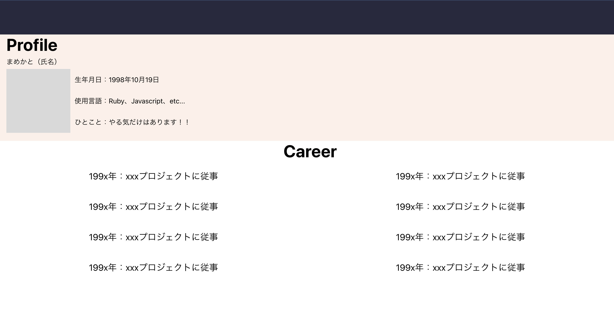

## 使用言語
- docker
- Ruby On Rails
- React

## デザインツール
- Figmaを使用

## 環境構築
1. git clone git@github.com:mermaid-kato/portfolio.git
2. make build
3. make up
4. make setup
5. localhost:3000で素晴らしいポートフォリオが表示されます！

## 実装画面

